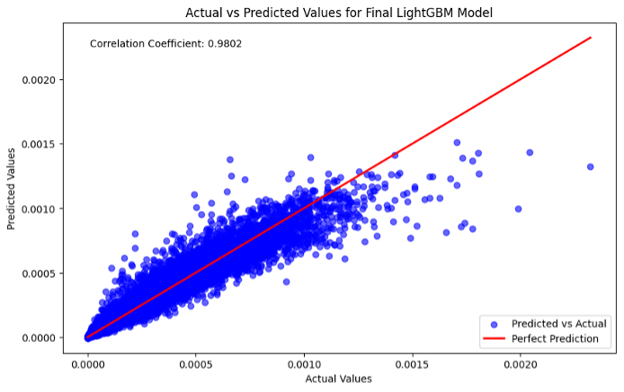
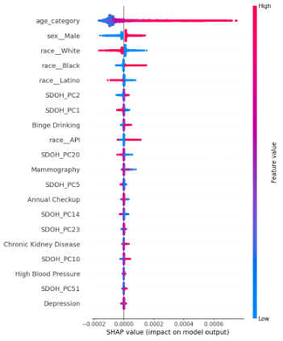

# ADS-599-Capstone
USD MS ADS 599: Capstone Project for Roger Qiu & Shailja Somani (Summer 2024)

## Project Title
Study of Stomach Cancer Mortality Rates across U.S. Counties

## Project Status
Completed

## Installation
To use, install, run, or edit this project on your machine, follow these steps:

```bash
git init
git clone https://github.com/shailja-somani-0/ADS-599-Capstone.git
```

## Project Intro/Objective
The main purpose of this project is to use data science methods and create machine learning models to analyze and predict stomach cancer mortality rates across different U.S. counties' subpopulations (populations are split out by race, age group, & sex within counties), considering various factors such as demographics, social determinants of health (SDOH) factors, and CDC health equity measures. The latter two are at the county-level. The aim is to identify patterns and contributing factors to high stomach cancer mortality rates, to better understand and address disparities in cancer outcomes. The aim is to contribute to reducing stomach cancer mortality rates in the U.S. and increasing heatlh equity, providing actionable insights for public health officials, policymakers, and healthcare providers.

## Partner(s)/Contributor(s)
 - Shailja Somani
 - Roger Qiu

## Methods Used
 - Data Engineering
 - Data Mining
 - Data Visualization
 - EDA
 - Inferential Statistics
 - Dimentionality Reduction (PCA)
 - Predictive Modeling
 - Machine Learning
 - Hyperparameter Tuning (GridSearchCV)
 - SHAP Values for Model Explainability 

## Project Description
This project involves a detailed county subpopulation-level analysis of stomach cancer mortality rates, using data from the National Center for Health Statistics (NCHS) combined with additional datasets such as SDOH and detailed county-level health measures. The dataset includes numerous variables, providing a comprehensive view of the factors influencing mortality rates. Key questions and hypotheses explored include the influence of demographic and socioeconomic factors on stomach cancer outcomes and the effectiveness of machine learning models in predicting these rates.

### Datasets Used
1. United States Stomach Cancer Mortality Rates by County, Race, and Ethnicity 2000-2019; Obtained from [Global Health Data Exchange](https://ghdx.healthdata.org/record/ihme-data/united-states-stomach-cancer-mortality-by-county-race-ethnicity-2000-2019)
2. Social Determinants of Health Data by U.S. County; Obtained from [Agency for Healthcare Research and Quality](https://www.ahrq.gov/sdoh/data-analytics/sdoh-data.html#download)
3. Detailed Health Measures & Metrics by County; Obtained from [CDC PLACES Dataset](https://data.cdc.gov/500-Cities-Places/PLACES-Local-Data-for-Better-Health-ZCTA-Data-2023/qnzd-25i4/about_data)
4. FIPS to ZCTA Crosswalk; Obtained from [DataWorld](https://data.world/nrippner/fips-to-zip-code-crosswalk), which is a well-formatted version of [US Census Data](https://www.census.gov/programs-surveys/geography/technical-documentation/records-layout/2010-zcta-record-layout.html)

## Results
Seven regression models were tested with various hyperparameters for each using 5-fold cross-validation with RMSE as the metric to minimize. Two dimensionality reduction methods were tested: selecting only 15 key columns of the 309 SDOH features (along with all other features) and conducting PCA to turn those 309 SDOH columns to 90 components (then adding that back to all other features). The best model was a LightGBM model with learning_rate: 0.1, max_depth: 20, n_estimators: 20 that was trained on all demographic and CDC health equity features, as well as the 90 PCA components for the SDOH features. The RMSE for that model was 0.0000355 (36.8% of the target mean, which is 0.00009633), the adjusted R2 was 0.9607, and the correlation coefficient for the actual vs. predicted values in the test set was 0.9802. SHAP values are used to further dive into the model.

### Actual vs. Predicted Values for Final LightGBM Model on Test Data


### Global SHAP Values for Final Model


## License
This project is licensed under the MIT License. Please refer to the LICENSE file in the project folder for more details.

## Acknowledgments
We would like to thank our instructors and peers in the ADS-599 course for their guidance and support. Special thanks to the aforementioned data providers for their invaluable data resources.
